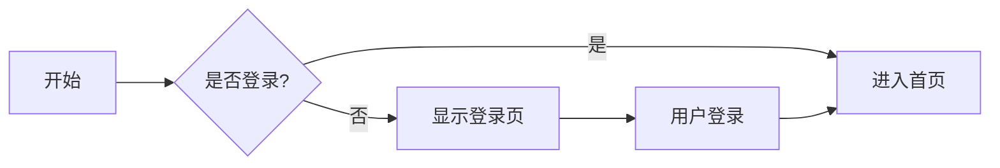

# Markdown高级特性指南

Markdown是一种轻量级标记语言，让我们能够使用易读易写的纯文本格式编写文档，然后转换成结构化的HTML。在这篇文章中，我们将探索Markdown的一些高级特性。

## 基础语法回顾

在深入高级特性之前，让我们快速回顾一下基础语法：

```markdown
# 一级标题
## 二级标题
### 三级标题

**粗体文本**
*斜体文本*
~~删除线~~

- 无序列表项
- 另一个列表项

1. 有序列表项
2. 第二个项目

[链接文本](https://example.com)


> 这是一段引用
```

## 代码块与语法高亮

Markdown支持代码块和语法高亮，特别适合技术博客：

```javascript
function hello() {
  console.log("Hello, world!");
  return true;
}
```

```css
.blog-post {
  font-family: system-ui, sans-serif;
  line-height: 1.5;
  max-width: 65ch;
}
```

```python
def fibonacci(n):
    a, b = 0, 1
    for _ in range(n):
        yield a
        a, b = b, a + b
```

## 表格

Markdown允许创建表格：

| 名称 | 类型 | 描述 |
|------|------|------|
| id | string | 唯一标识符 |
| title | string | 文章标题 |
| content | string | 文章内容 |
| created_at | date | 创建时间 |

## 任务列表

你可以创建任务列表：

- [x] 项目设计
- [x] 基础功能实现
- [ ] 高级特性开发
- [ ] 测试与部署

## 脚注

Markdown支持脚注[^1]，可以用来添加引用或额外解释。

[^1]: 这是一个脚注示例。

## 数学公式

使用LaTeX语法，我们可以在Markdown中渲染数学公式：

内联公式: $E = mc^2$

块级公式:

$$
\frac{n!}{k!(n-k)!} = \binom{n}{k}
$$

## 图表（使用Mermaid）

一些Markdown渲染器支持Mermaid图表：



## 目录

许多Markdown处理器支持自动生成目录（TOC）：

[TOC]

## 自定义容器

某些Markdown扩展支持自定义容器：

::: tip
这是一个提示容器
:::

::: warning
这是一个警告容器
:::

::: danger
这是一个危险警告容器
:::

## 使用HTML

Markdown允许直接使用HTML，这在某些情况下非常有用：

<div style="padding: 15px; background-color: #f8f9fa; border-left: 4px solid #4CAF50;">
  这是一个使用HTML创建的自定义样式块。
</div>

## 折叠块

<details>
<summary>点击展开更多内容</summary>

这里是被折叠的内容，可以包含任何Markdown元素。

- 列表项1
- 列表项2
- 列表项3

</details>

## 视频嵌入

使用HTML，你可以在Markdown中嵌入视频：

<iframe width="560" height="315" src="https://www.youtube.com/embed/dQw4w9WgXcQ" frameborder="0" allow="autoplay; encrypted-media" allowfullscreen></iframe>

## 结论

通过本文介绍的这些高级特性，你可以大大提升你的Markdown文档的表现力和交互性。在博客平台中充分利用这些特性，可以为读者提供更加丰富和吸引人的阅读体验。

## 参考资料

- [CommonMark](https://commonmark.org/)
- [GitHub Flavored Markdown](https://github.github.com/gfm/)
- [Markdown Guide](https://www.markdownguide.org/)